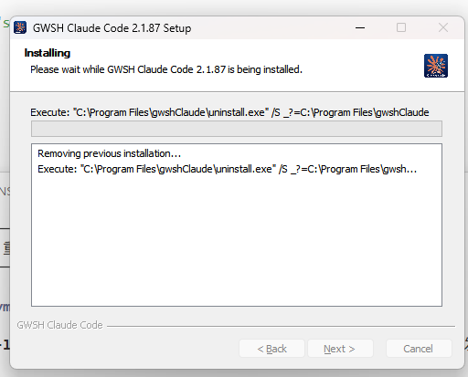
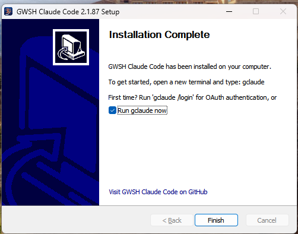
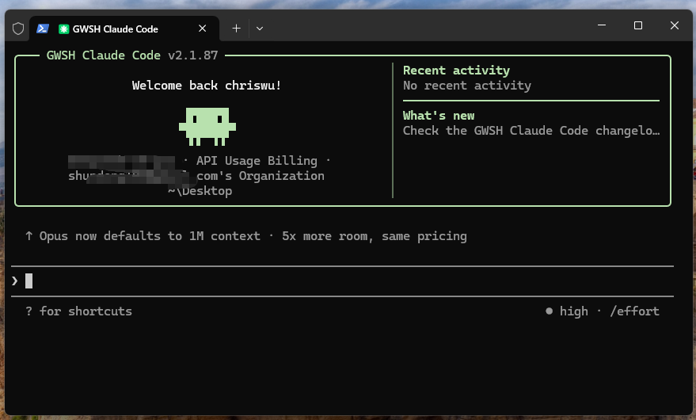

# Local Claude Code

> English | [中文](README_CN.md)

A desktop-installable build based on [free-code](https://github.com/paoloanzn/free-code) and [Claude Code](https://github.com/anthropics/claude-code). Provides one-click installers for Windows, macOS, and Linux — no terminal setup, no manual dependency hunting.

## Origin

This project is forked from [free-code](https://github.com/paoloanzn/free-code), which itself is a community build of Anthropic's official [Claude Code](https://github.com/anthropics/claude-code) CLI.

The core goal: **make installation dead simple**. Download the installer, double-click, start coding. No Node/Bun setup, no CLI-fu required.

## Quick Start

### Windows

1. Download the latest `gwsh-code-setup-x.x.x.exe` from [Releases](../../releases)
2. Double-click to launch the installer (auto-detects Git, configures PATH, creates Start Menu shortcut)
3. Open a terminal and type `gclaude`
4. On first run, use `gclaude /login` for OAuth or set `ANTHROPIC_API_KEY`

### macOS

1. Download the latest `gwsh-code-x.x.x.pkg` from [Releases](../../releases)
2. Double-click to install, or run: `sudo installer -pkg gwsh-code-x.x.x.pkg -target /`
3. Open a terminal and type `gclaude`
4. On first run, use `gclaude /login` for OAuth

### Linux

1. Download the latest `gwsh-code-x.x.x-linux-x64.tar.gz` from [Releases](../../releases)
2. Extract and run the install script:
   ```bash
   tar -xzf gwsh-code-*-linux-x64.tar.gz
   cd gwsh-code-*
   sudo bash install.sh
   ```
3. Type `gclaude` to start

## Screenshots

| Installation | Install Success | Startup |
|:---:|:---:|:---:|
|  |  |  |

## Model Providers

Five providers supported out of the box:

| Provider | Activation | Auth |
|----------|------------|------|
| Anthropic (default) | -- | `ANTHROPIC_API_KEY` or OAuth |
| OpenAI Codex | `CLAUDE_CODE_USE_OPENAI=1` | OAuth |
| AWS Bedrock | `CLAUDE_CODE_USE_BEDROCK=1` | AWS credentials |
| Google Vertex AI | `CLAUDE_CODE_USE_VERTEX=1` | `gcloud` ADC |
| Anthropic Foundry | `CLAUDE_CODE_USE_FOUNDRY=1` | `ANTHROPIC_FOUNDRY_API_KEY` |

## Build from Source

```bash
# Install dependencies
bun install

# Build + package (auto-detects platform)
bun run build

# Compile only (skip packaging)
bun run compile

# Package only (skip compilation, uses existing binary)
bun run package
```

### Build Variants

| Command | Output | Description |
|---------|--------|-------------|
| `bun run build` | `./dist/gclaude` + installer | Standard build + platform packaging |
| `bun run build:dev` | `./gclaude-dev` | Development version |
| `bun run build:dev:full` | `./gclaude-dev` | All experimental features enabled |
| `bun run compile` | `./dist/gclaude` | Compile only, no packaging |

### Platform-Specific Packaging

Run on the target platform:

```bash
# Windows (requires NSIS)
bun run build    # → dist/installer/gwsh-code-setup-x.x.x.exe

# macOS (requires Xcode CLI Tools for pkgbuild)
bun run build    # → dist/installer/gwsh-code-x.x.x.pkg

# Linux
bun run build    # → dist/installer/gwsh-code-x.x.x-linux-x64.tar.gz
```

### Requirements

- [Bun](https://bun.sh) >= 1.3.11
- **Windows**: [NSIS](https://nsis.sourceforge.io/) (`winget install NSIS.NSIS`)
- **macOS**: Xcode Command Line Tools (pkgbuild is built-in)
- **Linux**: No extra dependencies (outputs tar.gz)

## Usage

```bash
# Interactive REPL (default)
./gclaude

# One-shot mode
./gclaude -p "explain the code in this directory"

# Specify a model
./gclaude --model claude-opus-4-6

# OAuth login
./gclaude /login
```

## Project Structure

```
scripts/
  build.ts                # Build script with feature flag system

src/
  entrypoints/cli.tsx     # CLI entry point
  commands.ts             # Slash command registry
  tools.ts                # Agent tool registry
  QueryEngine.ts          # LLM query engine
  screens/REPL.tsx        # Main interactive UI (Ink/React)

  commands/               # Slash command implementations
  tools/                  # Agent tool implementations (Bash, Read, Edit, etc.)
  components/             # Ink/React terminal UI components
  hooks/                  # React hooks
  services/               # API clients, MCP, OAuth, analytics
    api/                  # API client + Codex adapter
    oauth/                # OAuth flows (Anthropic + OpenAI)
  state/                  # App state management
  utils/                  # Utilities
    model/                # Model configs, providers, validation
  skills/                 # Skill system
  plugins/                # Plugin system
  bridge/                 # IDE bridge
  voice/                  # Voice input
  tasks/                  # Background task management
```

## Tech Stack

| | |
|---|---|
| **Runtime** | [Bun](https://bun.sh) |
| **Language** | TypeScript |
| **Terminal UI** | React + [Ink](https://github.com/vadimdemedes/ink) |
| **CLI Parsing** | [Commander.js](https://github.com/tj/commander.js) |
| **Schema Validation** | Zod v4 |
| **Code Search** | ripgrep (bundled) |
| **Protocols** | MCP, LSP |
| **APIs** | Anthropic Messages, OpenAI Codex, AWS Bedrock, Google Vertex AI |

## Upstream Projects

- [Claude Code](https://github.com/anthropics/claude-code) — Anthropic's official CLI AI coding assistant
- [free-code](https://github.com/paoloanzn/free-code) — Community build of Claude Code

## License

Built on [free-code](https://github.com/paoloanzn/free-code). Original Claude Code source is property of Anthropic. Use at your own discretion.
